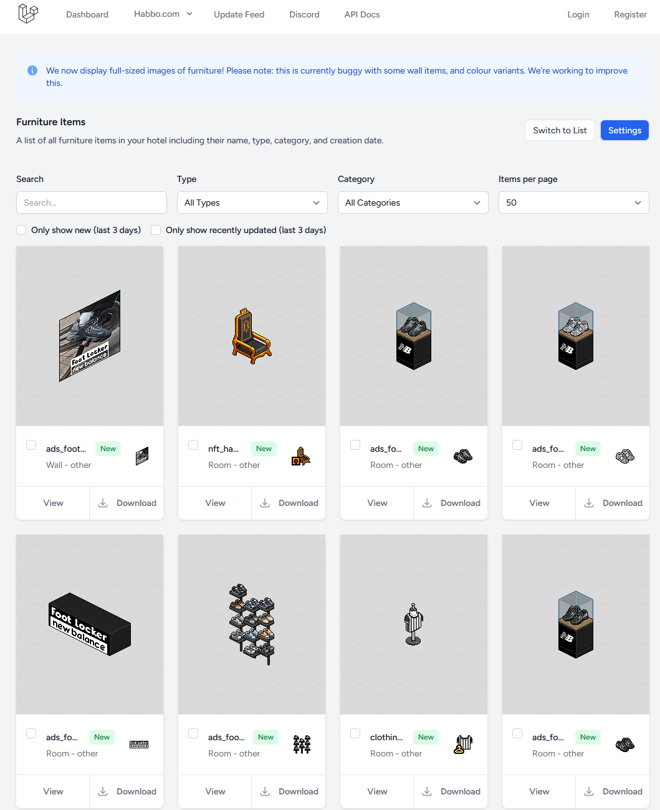

# Habbo Furni Data Downloader & Processor

This project provides a set of Python scripts to download and process Habbo Hotel furni data using the public API from [HabboFurni.com](https://habbofurni.com/).

## Data Source

The data is sourced directly from the HabboFurni API, which provides comprehensive information about furniture across multiple hotels.

*(Screenshot of the HabboFurni.com website)*


## Features

-   **Interactive Downloader**: Interactively choose which hotel's data to download (or download from all of them).
-   **Data Enrichment**: Combines furni data from the `.COM` (English) and `.ES` (Spanish) hotels to create a bilingual dataset.
-   **Structured Output**: Automatically organizes each processed furni into its own folder, identified by its `classname`, making individual data easy to access.
-   **Secure Configuration**: Keeps your API token in a separate configuration file to avoid exposing it in the main scripts.

## Project Structure

```
.
├── docs/
│   └── images/
│       └── habbofurni_screenshot.png
├── habbo_furni_data/
├── furni_database/
├── config.py
├── download_furni.py
├── process_furni.py
├── requirements.txt
└── README.md
```

## Installation

1.  **Clone or download this repository.**

2.  **Ensure you have Python 3 installed.**

3.  **Install the required dependencies using the `requirements.txt` file.**
    Open a terminal in the project's root folder and run the following command. This will automatically install `requests` and any other necessary libraries.
    ```bash
    pip install -r requirements.txt
    ```

## Configuration

Before you can use the scripts, you must configure your API token.

1.  **Get your API token** from your account on [HabboFurni.com](https://habbofurni.com/).
2.  **Open the `config.py` file**.
3.  **Replace the placeholder text `"YOUR_BEARER_TOKEN_HERE"`** with your actual token.

    ```python
    # in config.py
    API_TOKEN = "eyJ0eXAi...your_full_token_here"
    ```

4.  **(Optional but Recommended)** If you are using Git, add `config.py` to your `.gitignore` file to prevent accidentally committing your secret credentials to a public repository.

## Usage

### Step 1: Download the Data (`download_furni.py`)

This script connects to the API and downloads furni information from your chosen hotel. To use the `process_furni.py` script, you will need to have downloaded data from at least **Habbo.com** and **Habbo Spain**.

**To run:**

```bash
python download_furni.py
```

You will be presented with an interactive menu to select the hotel. The resulting JSON files will be saved in the `habbo_furni_data/` folder.

### Step 2: Process the Data (`process_furni.py`)

This script takes the `COM_furnis.json` and `ES_furnis.json` files from the `habbo_furni_data/` directory, merges them, and organizes the output.

**Prerequisites:** You must have already downloaded the data for Habbo.com (option 1) and Habbo Spain (option 3) using the download script.

**What it does:**
-   It uses each furni from `COM_furnis.json` as the base.
-   It finds the corresponding furni in `ES_furnis.json` using the `classname`.
-   It adds `name_es` and `description_es` fields to the furni data object.
-   It creates a new folder inside `furni_database/` named after the furni's `classname`.
-   It saves a `data.json` file with the complete, merged information inside that folder.

**To run:**

```bash
python process_furni.py
```

#### Example Output

After processing, each furni will have its own `data.json` file inside its respective folder (e.g., `furni_database/shelves_norja/`). The structure of this file will look like this, now including the Spanish translations:

```json
{
  "id": 1,
  "classname": "shelves_norja",
  "created_at": "2024-08-31T23:40:51.000000Z",
  "updated_at": "2024-08-31T23:40:51.000000Z",
  "hotelData": {
    "id": 30063,
    "classname": "shelves_norja",
    "hotel_id": 1,
    "type": "room",
    "name": "Iced Shelf",
    "description": "For your stuff.",
    "name_es": "Estanteria",
    "description_es": "Para colocar tus emociones",
    "revision": 61856,
    "category": "shelf",
    "furni_line": "iced",
    "icon": {
      "exists": true,
      "url": "https://habbofurni.com/furni_assets/61856/shelves_norja_icon.png",
      "path": "61856/shelves_norja_icon.png"
    }
    // ... other hotelData fields
  },
  "swf_data": {
    // ... swf_data fields
  }
}
```